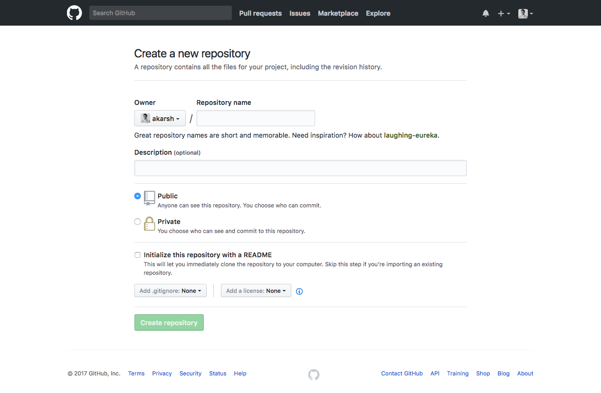
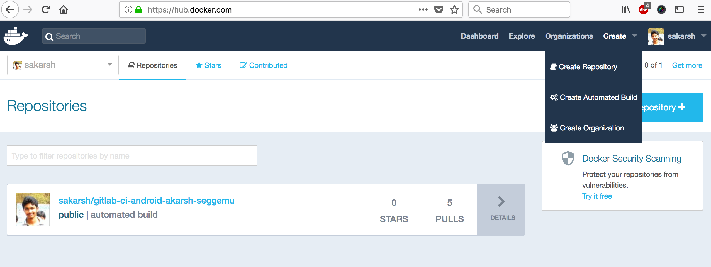
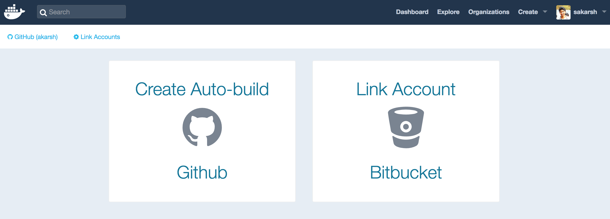
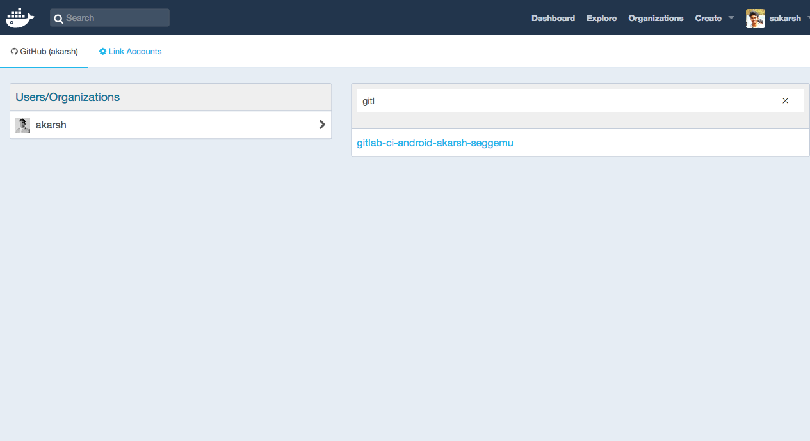
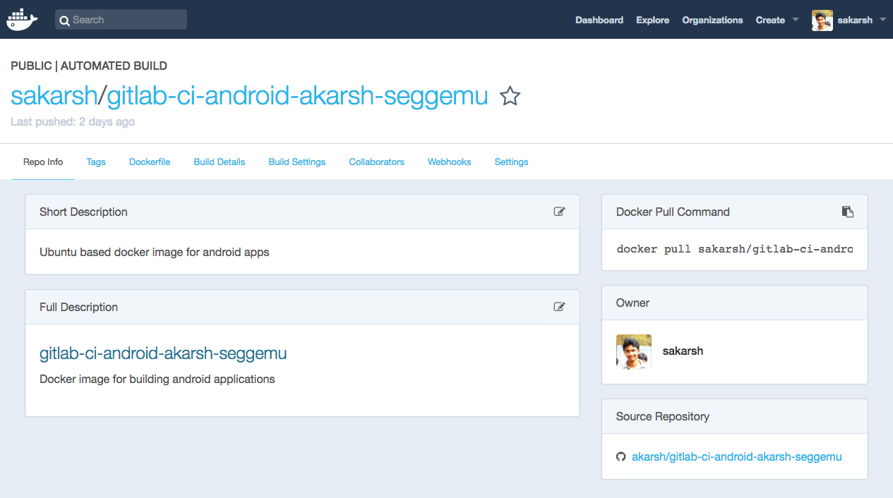
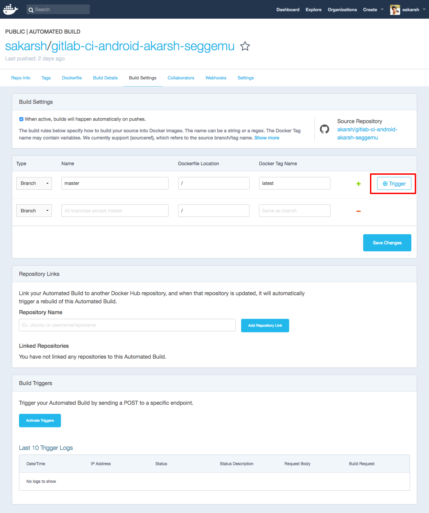
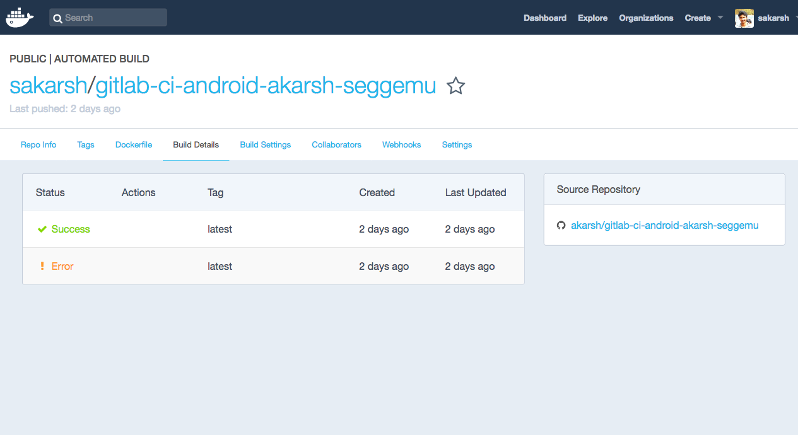
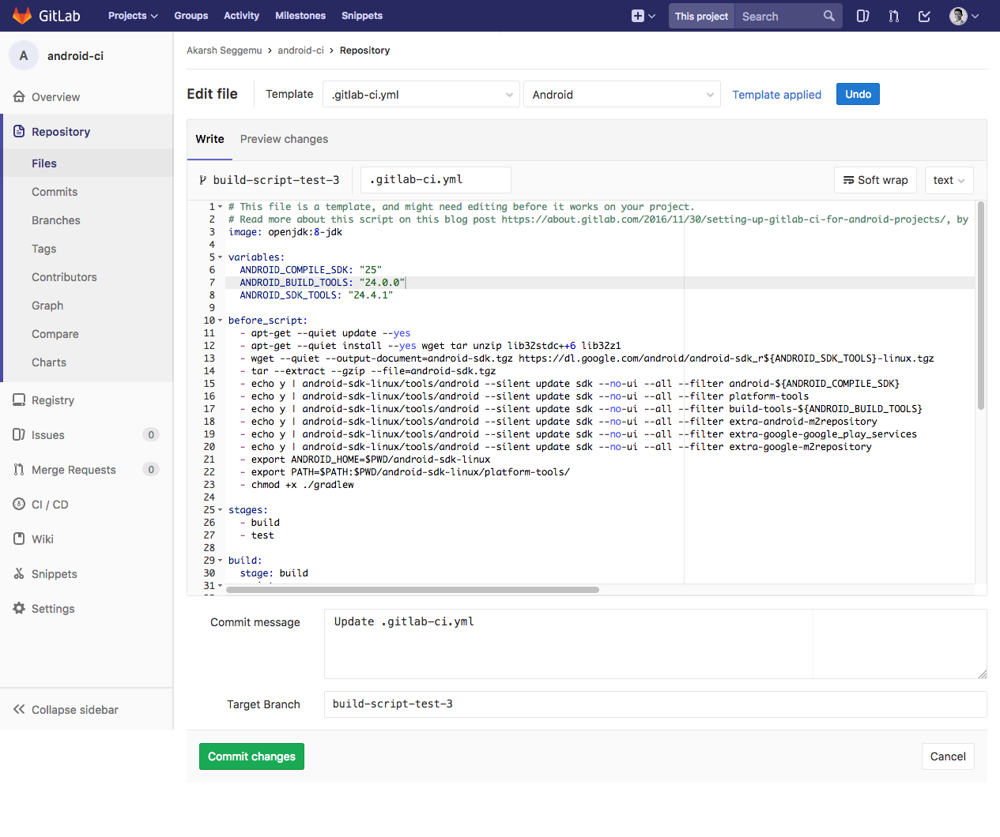

# Android CI tutorial for Docker and GitLab

The projects presents Android CI tutorial covering Docker and GitLab

- [Android CI tutorial for Docker and GitLab](#android-ci-tutorial-for-docker-and-gitlab)
    - [Docker](#docker)
    - [GitLab](#gitlab)
        - [Tutorials](#tutorials)
        - [References to Dockerfiles](#references-to-dockerfiles)

## Docker

Goal: To create a Docker image that contains the Android SDK command line tools installed in it.

- Create a account in [Docker](https://www.docker.com/). Then go to [Docker hub](https://hub.docker.com).

- Next, link your Github or Bitbucket account to your Docker account.


- Then, go to Github or Bitbucket to create a new repository that contains Docker file. Because, Docker currently supports only Github and Bitbucket for creating automation builds.



- After creating a repository in Github or Bitbucket. Create a new file. Name the file as

        Dockerfile

    without any extensions.


Here is the code for Dockerfile

```Docker
#
# GitLab CI: Android
# Version: 1.0.0
#
# https://hub.docker.com/r/sakarsh/gitlab-ci-android-akarsh-seggemu/
#

FROM ubuntu:18.04
MAINTAINER Akarsh Seggemu <sakarshkumar@gmail.com>

ENV VERSION_SDK_TOOLS "3859397"

ENV ANDROID_HOME "/sdk"
ENV PATH "$PATH:${ANDROID_HOME}/tools"
ENV DEBIAN_FRONTEND noninteractive

RUN apt-get -qq update && \
    apt-get install -qqy --no-install-recommends \
      bzip2 \
      curl \
      git-core \
      html2text \
      openjdk-8-jdk \
      libc6-i386 \
      lib32stdc++6 \
      lib32gcc1 \
      lib32ncurses5 \
      lib32z1 \
      unzip \
    && rm -rf /var/lib/apt/lists/* /tmp/* /var/tmp/*

RUN rm -f /etc/ssl/certs/java/cacerts; \
    /var/lib/dpkg/info/ca-certificates-java.postinst configure

RUN curl -s https://dl.google.com/android/repository/sdk-tools-linux-${VERSION_SDK_TOOLS}.zip > /sdk.zip && \
    unzip /sdk.zip -d /sdk && \
    rm -v /sdk.zip

RUN mkdir -p $ANDROID_HOME/licenses/ \
  && echo "8933bad161af4178b1185d1a37fbf41ea5269c55\nd56f5187479451eabf01fb78af6dfcb131a6481e" > $ANDROID_HOME/licenses/android-sdk-license \
  && echo "84831b9409646a918e30573bab4c9c91346d8abd" > $ANDROID_HOME/licenses/android-sdk-preview-license

ADD packages.txt /sdk
RUN mkdir -p /root/.android && \
  touch /root/.android/repositories.cfg && \
  ${ANDROID_HOME}/tools/bin/sdkmanager --update 

RUN while read -r package; do PACKAGES="${PACKAGES}${package} "; done < /sdk/packages.txt && \
    ${ANDROID_HOME}/tools/bin/sdkmanager ${PACKAGES}
```

The Dockerfile code contains the following,

  - The base OS image is defined in **FROM**
  - The maintainer of the docker in **MAINTAINER**
  - The Android SDK tools is update after evey new release. With every new update the version number in the download link is updated. Having a variable **ENV VERSION_SDK_TOOLS** for the version number reduces the effort in long run for maintaining the Dockerfile.
  - **ENV ANDROID_HOME** is used for storing sdk folder name.
  - **ENV PATH** is used for storing the android sdk tools path.
  - **DEBIAN_FRONTEND** is used for installing the packages in Docker.
  - **RUN apt-get -qq update** and the consecutive commands are used to update the packages and install packages.
  - **RUN rm -f /etc/ssl/certs/java/cacerts;** is used for java ceritifcate.
  - **RUN curl -s https://dl.google.com/android/repository/sdk-tools-linux-${VERSION_SDK_TOOLS}.zip** for downloading the Android SDK tools
  - **RUN mkdir -p $ANDROID_HOME/licenses/** is used for creating a directory to accept Android SDK license during installation of Android SDK Tools.
  - **ADD packages.txt /sdk** this command adds the file  packages.txt ti the sdk folder.

    - The packages.txt contains the additional packages such as Google play services to be installed.

    - Create a new file in the repository and name it as

            packages.txt

        and add the following code,

        ```Docker
            add-ons;addon-google_apis-google-24
            build-tools;26.0.2
            extras;android;m2repository
            extras;google;m2repository
            extras;google;google_play_services
            extras;m2repository;com;android;support;constraint; constraint-layout;1.0.2
            extras;m2repository;com;android;support;constraint; constraint-layout-solver;1.0.2
            platform-tools
            platforms;android-26
        ```
  - **RUN mkdir -p /root/.android &&** is used to create a folder and the subsequent commands are used to update the Android SDK.

  - **RUN while read -r package; do PACKAGES="${PACKAGES}${package}** is used to run the packages.txt file. Next, the packages are downloaded and installed.

- After the creating the Dockerfile and adding the mentioned code above. Next, go to [Docker hub](https://hub.docker.com) and click on **create a automated build**



- Select the linked Github or bitbucket account to access the Github or Bitbucket repository.



- Select the Github or Bitbucket repository.



- Add a short description for the automated build and click on create.


- Build page will be shown after completing the creation of automated build.



- Next, click on **Build Settings** tab and click on **trigger** to **trigger** a build job.



- When the build job is completed. Click on **Build Details** to see the status of the build. **Success** indicated the build is successfully built the docker image. Now, the Docker image is ready.



## GitLab

Follow the instructions on GitLab Documentation about [Creatin .gitlab-ci.yml](https://docs.gitlab.com/ee/ci/quick_start/README.html) file.

A standard template file for Android application development provided by GitLab as follows,

```yml
# This file is a template, and might need editing before it works on your project.
# Read more about this script on this blog post https://about.gitlab.com/2016/11/30/setting-up-gitlab-ci-for-android-projects/, by Greyson Parrelli
image: openjdk:8-jdk

variables:
  ANDROID_COMPILE_SDK: "25"
  ANDROID_BUILD_TOOLS: "24.0.0"
  ANDROID_SDK_TOOLS: "24.4.1"

before_script:
  - apt-get --quiet update --yes
  - apt-get --quiet install --yes wget tar unzip lib32stdc++6 lib32z1
  - wget --quiet --output-document=android-sdk.tgz https://dl.google.com/android/android-sdk_r${ANDROID_SDK_TOOLS}-linux.tgz
  - tar --extract --gzip --file=android-sdk.tgz
  - echo y | android-sdk-linux/tools/android --silent update sdk --no-ui --all --filter android-${ANDROID_COMPILE_SDK}
  - echo y | android-sdk-linux/tools/android --silent update sdk --no-ui --all --filter platform-tools
  - echo y | android-sdk-linux/tools/android --silent update sdk --no-ui --all --filter build-tools-${ANDROID_BUILD_TOOLS}
  - echo y | android-sdk-linux/tools/android --silent update sdk --no-ui --all --filter extra-android-m2repository
  - echo y | android-sdk-linux/tools/android --silent update sdk --no-ui --all --filter extra-google-google_play_services
  - echo y | android-sdk-linux/tools/android --silent update sdk --no-ui --all --filter extra-google-m2repository
  - export ANDROID_HOME=$PWD/android-sdk-linux
  - export PATH=$PATH:$PWD/android-sdk-linux/platform-tools/
  - chmod +x ./gradlew

stages:
  - build
  - test

build:
  stage: build
  script:
    - ./gradlew assembleDebug
  artifacts:
    paths:
    - app/build/outputs/

unitTests:
  stage: test
  script:
    - ./gradlew test

functionalTests:
  stage: test
  script:
    - wget --quiet --output-document=android-wait-for-emulator https://raw.githubusercontent.com/travis-ci/travis-cookbooks/0f497eb71291b52a703143c5cd63a217c8766dc9/community-cookbooks/android-sdk/files/default/android-wait-for-emulator
    - chmod +x android-wait-for-emulator
    - echo y | android-sdk-linux/tools/android --silent update sdk --no-ui --all --filter sys-img-x86-google_apis-${ANDROID_COMPILE_SDK}
    - echo no | android-sdk-linux/tools/android create avd -n test -t android-${ANDROID_COMPILE_SDK} --abi google_apis/x86
    - android-sdk-linux/tools/emulator64-x86 -avd test -no-window -no-audio &
    - ./android-wait-for-emulator
    - adb shell input keyevent 82
    - ./gradlew cAT

```



In the template, **openjdk:8-jdk** Docker image is used and all the Android SDK tools and packages are installed during the build job. They are listed in **before_script**.

Instead of downloading and installing Android SDK tools and packages every time during the build job. We can use the Docker image built above in the **.gitLab-ci.yml file**.

The Docker image created above can be used as follows,

        sakarsh/gitlab-ci-android-akarsh-seggemu:latest

By specifying the **Docker hub username/Docker image**. The **:latest** is used to get the latest build from Docker.

Using the Docker image mentioned above in **.gitlab-ci.yml** as follows,
```yml
image: sakarsh/gitlab-ci-android-akarsh-seggemu:latest

before_script:
  - export GRADLE_USER_HOME=`pwd`/.gradle
  - mkdir -p $GRADLE_USER_HOME
  - chmod +x ./gradlew

stages:
  - build
  - test

build:
  stage: build
  script:
    - ./gradlew assembleDebug
  artifacts:
    paths:
    - app/build/outputs/

unitTests:
  stage: test
  script:
    - ./gradlew test

functionalTests:
  stage: test
  script:
    - wget --quiet --output-document=android-wait-for-emulator https://raw.githubusercontent.com/travis-ci/travis-cookbooks/0f497eb71291b52a703143c5cd63a217c8766dc9/community-cookbooks/android-sdk/files/default/android-wait-for-emulator
    - chmod +x android-wait-for-emulator
    - echo y | android-sdk-linux/tools/android --silent update sdk --no-ui --all --filter sys-img-x86-google_apis-${ANDROID_COMPILE_SDK}
    - echo no | android-sdk-linux/tools/android create avd -n test -t android-${ANDROID_COMPILE_SDK} --abi google_apis/x86
    - android-sdk-linux/tools/emulator64-x86 -avd test -no-window -no-audio &
    - ./android-wait-for-emulator
    - adb shell input keyevent 82
    - ./gradlew cAT

```

Using an already configured Docker image with Android SDK tools and packages decreases the total build time.

### Tutorials

- [Dockerfile project](http://dockerfile.github.io/)

- [GitLab CI](https://docs.gitlab.com/ee/ci/)

### References to Dockerfiles

- [dockerfiles](https://github.com/jessfraz/dockerfiles) - contains various Dockerfiles.